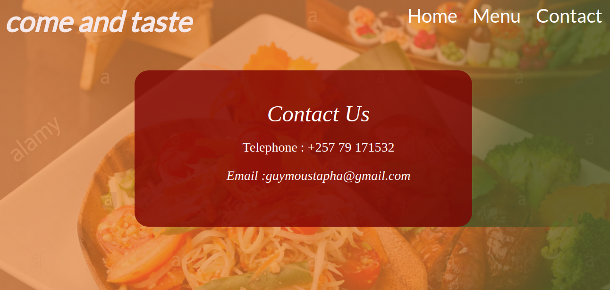
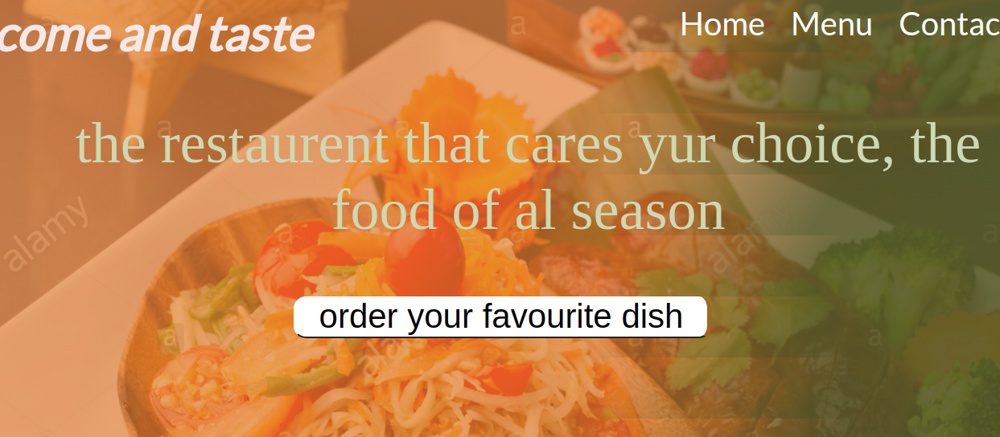

# Restaurent-page

This project is a small restaurant app created using javascript,when you can click on defrent taps and it will take you to the clicked page without refreching the page.

## Live Demo

[Link here](https://raw.githack.com/Guy-Gustave/Restaurent_page/main/dist/index.html)

## ScreenShoot




## Built With

- JavaScript
- VS Code

## Prerequisites

You must have a browser on your PC in order to use the application. [Click here](https://www.mozilla.org/en-US/firefox/new/) to download one.

## Getting Started

1. clone the project

```bash
# Clone this repository
$ https://github.com/Guy-Gustave/Restaurent_page/

# Go into the repository
$ cd RestaurantJS

# start the app
Copy the absolute path of the index file, paste on your browser and click on enter
```

## for webpack run:

```Terminal
$ npm run build

$ npm run start
```

## Usage

- open index.html in dist folder
- click on menu to see list of food in the menu
- click on contact to see the contact information

## Authors

👤 **Guy Gustave NIGABA**

- Github: [@Gustave](https://github.com/Guy-Gustave)
- Linkedin: [Guy-Gustave](https://www.linkedin.com/in/guy-gustave-nigaba)
- E-mail: [guymoustapha@gmail.com](guymoustapha@gmail.com)

## 🤝 Contributing

Contributions, issues and feature requests are welcome!

Feel free to check the <a href=" target="_blank">issues page</a>.

## Show your support

Give a ⭐️ if you like this project!

## Acknowledgments

- <a href="https://www.theodinproject.com/" target="_blank">The Odin Project</a>
